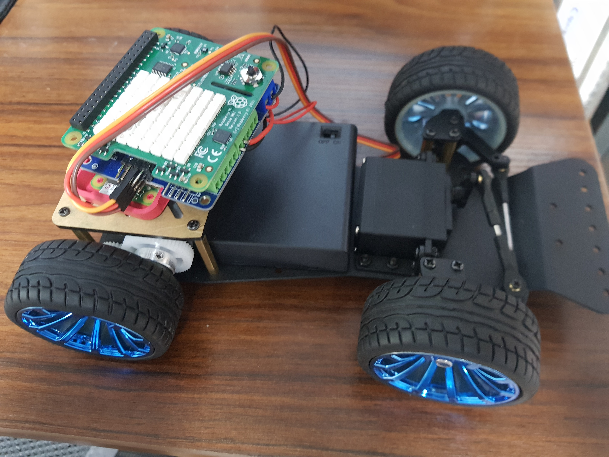
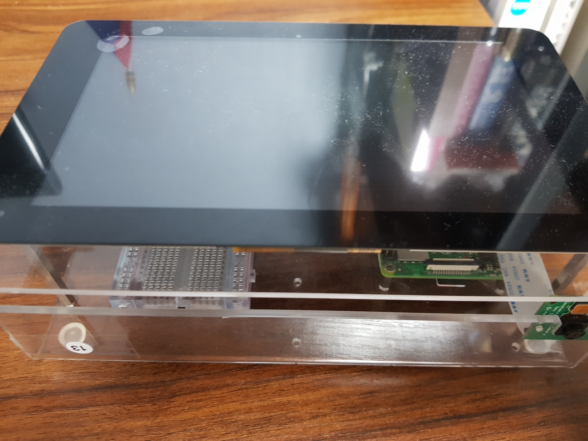
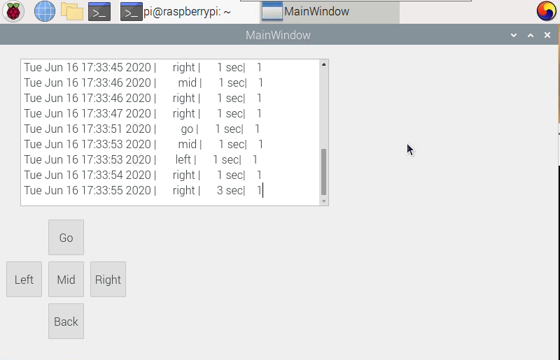
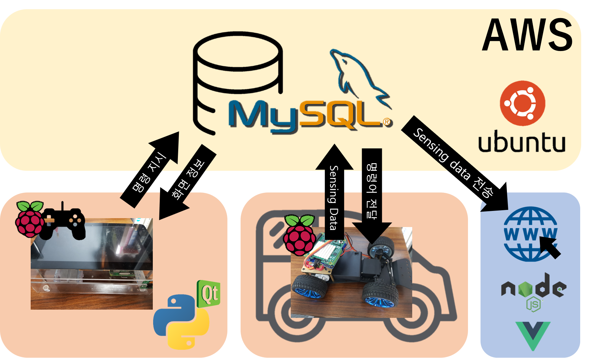

# 라즈베리파이를 활용한 RC-Car 제작 프로젝트


## 제안 배경

- 한 학기동안 배운 내용을 활용하기 위한 종합 프로젝트의 필요성
- 다른 준비 없이, 현재 활용가능한 라즈베리파이 zero, 4 보드를 활용하여 수행가능함


## 프로젝트 목표

### RC-Car



- 목표 1: ServoMotor를 제어하여 왼쪽, 오른쪽으로 바퀴 방향 바꾸는 기능 구현
- 목표 2: DcMotor를 제어하여 주어진 시간만큼 직진, 후진하는 기능 구현


### controller






- 목표 1: Controller에서 보낸 명령을 RC-Car에서 실시간으로 받아 수행하는 기능 구현
- 목표 2: PYQT5를 사용하여 Controller기능을 GUI 환경에서 제공
- 목표 3: SenseHat을 활용하여 측정한 데이터들을 실시간으로 DB에 전송, 저장하는 기능 구현
- *목표4*: Timer를 추가하여 특정 시간만큼 구동할 수 있게 하는 명령 추가하였음.


### WEB (추가예정)


## 활용 기술



- i2c 통신을 활용하여 RaspberryPi Zero와 MotorHAT 을 연결하고, 라이브러리를 활용하여 모터를 제어
- PyQt5를 활용하여 RC-Car 제어를 위한 GUI 환경 구성
- AWS의 EC2 서버, MySQL을 활용하여 자동차 이동 log와 센서로 측정한 데이터들을 저장할 수 있는 DB 구축 및 Controller와 RC-Car의 상호작용 구현
- QTSql을 활용하여 SenseHAT에서 측정한 데이터들을 DB에 저장.


## 초기설정에 대한 정보를 저장합니다.


## 연결 전 기본 설정.
```
    1.필요한 파일 ssh라는 이름의 빈 파일.
    2.네트워크 정보를 담고 있는 wpa_supplicant.conf 파일
    3.config.txt 파일 밑에 dtoverlay=dwc2 라고 추가해준다.
    4.cmdline.txt 파일에서 rootwait 뒤에 modules-load=dwc2,g_ether를 추가해준다.
    
    
```
- wpa_supplicant.conf
```
ctrl_interface=DIR=/var/run/wpa_supplicant GROUP=netdev update_config=1

network={
	ssid="아이디 적고"
	psk="비밀번호 적어주자."
}
```

## 연결 후 설정

1. rndis 드라이버를 사용하여 인터넷을 연결하는 방법.(arp -a 를 사용하거나 bonjour를 설치해서 ip확인)
- (bonjour의 경우 dns-sd -G v4 raspberrypi.local를 입력하여 확인)
2. 노트북의 핫스팟 서비스를 이용하여 인터넷을 연결
- 첫 실습에서는 oled를 위해서 spi를 켜줬음(raspi-config)


- pillow를 사용하여 그림을 그릴 수 있음.
```
sudo apt-get install libjpeg-dev -y
sudo apt-get install zlib1g-dev -y
sudo apt-get install libfreetype6-dev -y
sudo apt-get install liblcms1-dev -y
sudo apt-get install libopenjp2-7 -y
sudo apt-get install libtiff5 -y 
pip3 install pillow 
. 
```

## scp를 이용한 파일 다운로드
```
    라즈베리파이로 복사
    - scp 파일이름 pi@ip주소:폴더이름/
    라즈베리파이에서 복사
    - scp pi@ip주소:파일이름 .(현재 디렉토리를 의미)

```